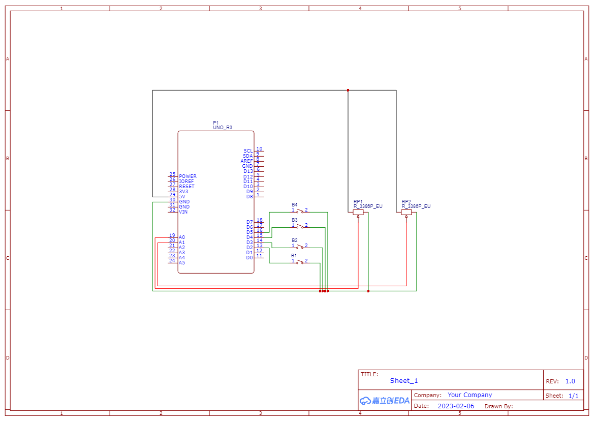

# Alt Pong - BLOON PONG

## Overview

- [Link to Demo (requires Arduino Uno/Redboard for serial input)]()
- [Link to code repo]()

### Proposal

After much brainstorming on how to create a new and unique experience to playing pong, I realized a couple of things:

1. Everything is derivative, nothing is truly original.
2. While I can't seem to find a way to make Pong "better" through an alternative controller, I can certainly make the whole experience worse.

Therefore, I tried to add a new layer of interaction into pong that will cause more direct strife between players. Assuming that they cooperate with the suspension of disbelief, players will now have the opportunity to blatantly sabotage the opposing player by popping their paddle, shrinking its actual size. Players do have the ability to "inflate" and grow their paddles by using a manual balloon inflator, but it will require the player to use both hands.

There are many flaws with this game plan already, but since I personally think the premise is hilarious, I'm going to try to make it.

### MVP

- [x] Get a working pong game in p5.js
- [x] Alter pong game to include two new functions
  - Increase paddle size
  - Decrease paddle size
- [x] Use serial I/O to connect RedBoard inputs to p5.js pong
- [x] Control the paddle location with the horizontal slide potentiometer
- [x] Control paddle sizes using momentary buttons to close the circuit
- [x] Fit the buttons into "proper" ~~improper~~ game enclosures
  - [x] Modify a manual balloon inflator to actuate a button press
  - [x] Build out an enclosure for a metal stake to poke a button (or build a switch using tinfoil, maybe even a bigass button that just says 'POP' it)

### Stretch Goals

- [ ] Refine enclosure?

---

## Progress

### Code

After finding the p5.js sketch for two player code from ARatherLongUsername, it was a matter of picking apart the different objects and adding a couple functions here and there.

- Mapping the potentiometer and removing the keyboard input for paddle control
- Set new functions to the two buttons to grow and shrink the paddle sizes

### Circuit

Using a redboard to control input, I was able to transfer input to p5.js through serial i/o.

## TL;DR

She's janky but she works.

---

## Resources

- [P5.js Two Player Pong by ARatherLongUsername](https://editor.p5js.org/ARatherLongUsername/sketches/ryo2_4GS7)
- [Serial Communication Walkthrough](https://itp.nyu.edu/physcomp/labs/labs-serial-communication/lab-serial-input-to-the-p5-js-ide/)
